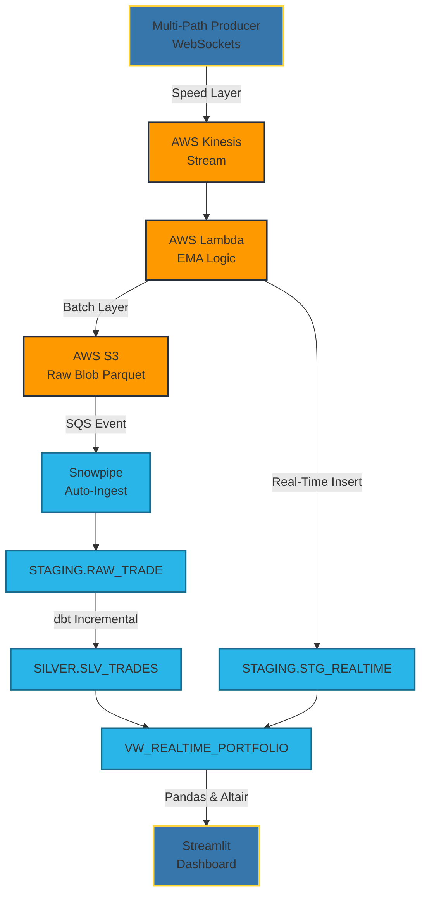

# Alpine Lambda Trade (ALT) 🏔️

**Senior Data Engineering project focused on building a true Lambda Architecture (Batch + Speed layers) targeting AWS and Snowflake.**

ALT consumes high-frequency Crypto Exchange data via WebSockets (Binance), dynamically buffering them into data lake blobs (historical processing), while actively passing live subsets into millisecond AWS Kinesis triggers for split-second volatility analysis - unifying them securely inside Snowflake's ecosystem.

## 🏗️ Architecture



---

## 💡 Business Objectives

The architecture directly aims at resolving key Data Engineering challenges in Finance:

- **P1: Avoid Slippage (Volatility)**:
   The AWS Kinesis and AWS Lambda pipeline process trades independently. Running stateless warm cache functions computes continuous Exponential Moving Averages (EMA) detecting spikes sub-second.
   
- **P2: Auditability and Immutability (Histories)**:
   A robust, deduplicated dbt Pipeline leverages Incremental loads to cast and save historical records forever as an absolute source of truth.

- **P3: The Live Portfolio Dilemma**:
   Leveraging a `UNION ALL`, the `VW_REALTIME_PORTFOLIO` accurately masks dual histories, ignoring overlaps, to ensure you can see your active and past trades completely deduplicated in real-time.

## 🚀 Getting Started

### Pre-requisites
- AWS Account securely synced (`aws configure`) or LocalStack.
- Snowflake Trial or Account.
- Python 3.10+ alongside `uv` installed.

### Setup Process

```bash
# Set up environments
cp .env.example .env
# Fill it out!

# 1. Spawn infrastructural pipelines natively
make init
make apply

# 2. Run the Producers to feed Kinesis and S3
make run-producer

# 3. Create historical pipelines using DBT
make dbt-run

# 4. View the dashboard!
make run-dashboard
```
